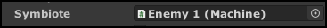

# Dual Bosses (Symbiote)

## Introduction

To start off, you'll first need 2 enemies with the `Machine` component. *This will not work if both enemies do not have the ***`Machine`*** component.*

## Linking the enemies

First, go to enemy 1's `Machine` component, find the `Symbiote` variable, and assign enemy 2's `Machine` component to that. Repeat the same but for enemy 2.

Example for Enemy 2:

For the enemies to heal, you require an animation in the enemy animation controller, named "Knockdown". You do not require any special events, make sure it's at least 2 seconds in length. 

Activate them like you would normally, using `Activate Arena` and `Activate Next Wave`.